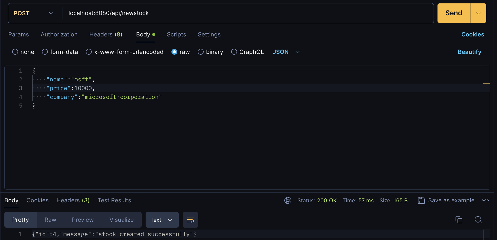
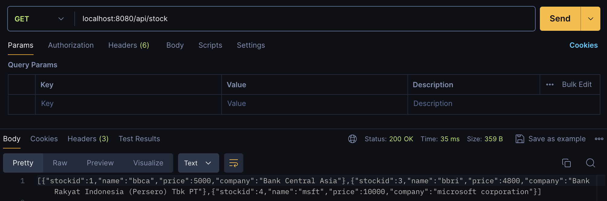
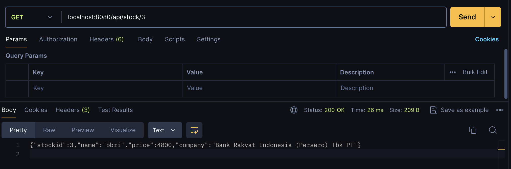
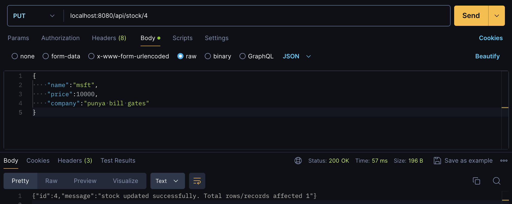
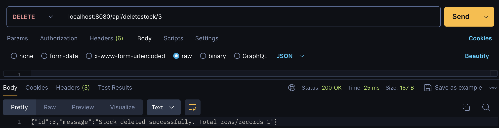
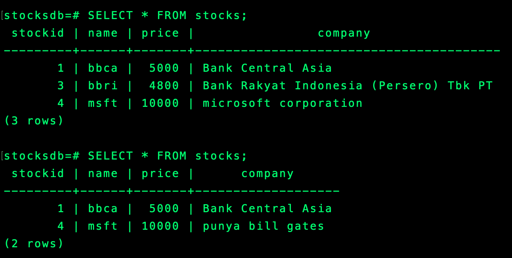

## Description
Learn how to connect Go with Postgres (and also learning Postgres, it took some time because it was my first time using pg and configuring it. and as expected, many errors appeared because of this, hehe. i learnt many things, such as how to create a database, how to create users and give access to the database, how to create tables, and like what i said above, how to connect pg to my go API).

## Working in postman
**Adding stock**
<a href ="" target="blank"> </a>

**Get All stock**
<a href ="" target="blank"> </a>

**Get stock by Id**
<a href ="" target="blank"> </a>

**Update stock**
<a href ="" target="blank"> </a>

**Delete stock**
<a href ="" target="blank"> </a>

**Database**
<a href ="" target="blank"> </a>
Table format database :
```
CREATE TABLE stocks (
    id SERIAL PRIMARY KEY,
    name TEXT,
    price INT,
    company TEXT
);
```